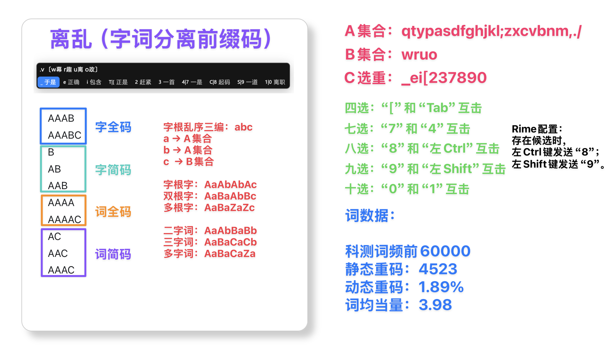
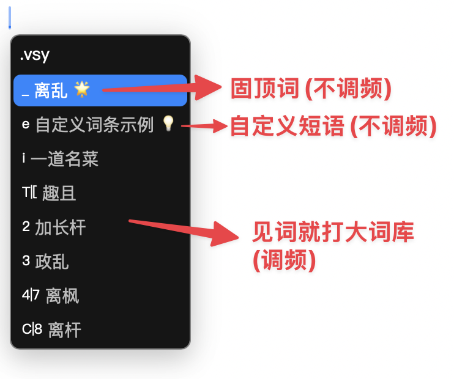
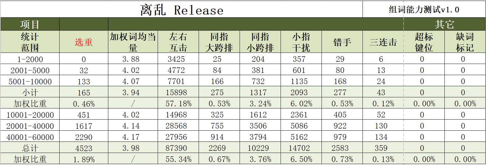

# 离乱方案 (LL Schema)

离乱输入法是一个基于RIME输入法引擎的高性能形码输入方案，采用前缀码设计理念，支持多重简词和智能词构。

## 项目概述

离乱输入法是一个现代化的形码输入方案，具有以下特点：

- **前缀码设计**：采用独特的前缀码结构，提高输入效率
- **高性能多重简词**：支持多级简码，减少重码率
- **智能词构**：基于词频和使用习惯的智能词库
- **字词分离**：单字和多字词独立编码，避免冲突
- **丰富反查**：支持拼音和超级笔画反查功能

## 项目结构

```
wf-ll/
├── README.md                    # 项目说明文档
├── gen_ll/                      # Go语言码表生成器
│   ├── main.go                  # 主程序入口
│   ├── go.mod                   # Go模块配置
│   ├── tools/                   # 工具模块
│   ├── types/                   # 数据类型定义
│   └── utils/                   # 工具函数
├── deploy/                      # 部署相关文件
│   ├── deploy.sh                # 部署脚本
│   └── 离乱/                    # 离乱方案数据文件
│       ├── ll_div.txt           # 汉字拆分表
│       ├── ll_map.txt           # 部件映射表
│       ├── freq.txt             # 字频表
│       ├── ll_words.txt         # 多字词表
│       ├── 玲珑.txt             # 玲珑多字词表
│       └── ll_citi_pre.txt      # 跟打词提预处理文件
├── schemas/                     # RIME方案文件
│   └── ll/                      # 离乱方案
│       ├── *.schema.yaml        # 方案配置文件
│       ├── *.dict.yaml          # 字典文件
│       └── lua/                 # Lua脚本扩展
├── template/                    # 模板文件
│   └── (结构与schemas/ll类似)
└── tools/                       # 辅助工具
    ├── assets/                  # 资源文件
    └── ll_div/                  # 拆分表处理工具
```

## 核心特性

### 1. 初衷设计


离乱输入法采用前缀码设计理念，通过合理的部件映射和编码规则，实现高效输入。

### 2. 字词分离


单字和多字词采用独立的编码体系，避免编码冲突，提高输入准确性。

### 3. 词库分类


词库按使用频率和场景进行分类管理，包括：
- 玲珑多字词[玲珑词库](https://github.com/hanzi-chai/DictLinglong)
- 自定义短语
- `jieba` 分词超大词库（后续将转为 `HanLP` 分词，分词、词频将更加精准）

### 4. 性能测评


经过科学测评，离乱输入法在输入速度、准确率和用户体验方面表现优异。

## 快速开始

### 环境要求

- Go 1.23+ (用于码表生成)
- RIME输入法引擎
- Bash shell环境

### 安装步骤

1. **克隆项目**
   ```bash
   git clone --depth 1 https://github.com/hertz-hwang/wf-ll
   cd wf-ll
   ```

2. **构建码表生成器**
   ```bash
   go build -C gen_ll -o ../deploy/gen_ll
   ```

3. **生成RIME方案**
   ```bash
   sh deploy/deploy.sh
   ```

4. **安装到RIME**
   ```bash
   # 将生成的方案文件复制到RIME用户目录
   cp -r schemas/ll/* ~/.local/share/fcitx5/rime/
   # 重新部署RIME
   rime_deployer
   ```

### 使用说明

#### 基本输入
- 使用标准键盘布局输入
- `` ` `` 键用于融合反查
- `o` 键对应 `，` 位置
- `'` 键对应 `。` 位置

#### 功能切换
- `Ctrl+Shift+N`: 中英文切换
- `Ctrl+Shift+O`: 全半角切换
- `5`: 字集过滤开关
- `i`: 造词模式开关

#### 反查功能
- `` ` ``: 融合反查
- `` `P``: 拼音反查
- `` `X``: 超级笔画反查

## 技术架构

### 码表生成流程

1. **数据加载**
   - 加载拆分表 (`ll_div.txt`)
   - 加载字根映射表 (`ll_map.txt`)
   - 加载字频表 (`freq.txt`)
   - 加载多字词表 (`ll_words.txt`)
   - 加载玲珑词表 (`玲珑.txt`)

2. **编码生成**
   - 生成单字全码
   - 生成单字简码
   - 生成多字词全码
   - 生成多字词简码
   - 生成玲珑多字词全、简编码

3. **文件输出**
   - 生成RIME字典文件
   - 生成拆分信息文件
   - 生成跟打词提文件
   - 生成Lua脚本数据

### 核心算法

#### 部件映射
```go
type Division struct {
    Char    string   // 字符
    Divs    []string // 拆分部件列表
    Pin     string   // 拼音
    Set     string   // 字集
    Unicode string   // Unicode编码
}
```

#### 编码生成
- 基于部件映射生成全码
- 根据字频和使用频率生成简码
- 支持多级简码长度限制

## 自定义配置

### 修改简码规则

在 [`deploy.sh`](deploy/deploy.sh:83) 中修改简码长度限制参数：

```bash
-l "1:4,2:4,3:0,4:0"      # 单字简码限制
-wL "1:4,2:4,3:4,4:0"     # 多字词简码限制
-ll "1:4,2:4,3:4,4:0"     # 玲珑多字词简码限制
```

### 修改RIME配置

编辑 [`schemas/ll/LL.schema.yaml`](schemas/ll/LL.schema.yaml:1) 文件：

```yaml
switches:
  - name: charset_filter
    states: [ 大字集, 常用字 ]
    reset: 1
```

## 开发指南

### 添加新功能

1. **修改Go代码**
   - 在 [`gen_ll/tools/`](gen_ll/tools/) 中添加新工具函数
   - 在 [`gen_ll/types/`](gen_ll/types/) 中定义新的数据类型

2. **更新部署脚本**
   - 修改 [`deploy.sh`](deploy/deploy.sh:1) 添加新的处理步骤
   - 更新参数配置

3. **测试验证**
   - 运行部署脚本生成新方案
   - 在RIME中测试新功能

### 调试技巧

启用调试模式：
```bash
./gen_ll -D -q ...
```

性能分析：
```bash
./gen_ll -p /tmp/gen_ll.prof ...
```

## 常见问题

### Q: 如何优化输入速度？
A: 调整简码长度限制，增加高频字词的简码分配。

## 贡献指南

1. Fork 本项目
2. 创建功能分支 (`git checkout -b feature/AmazingFeature`)
3. 提交更改 (`git commit -m 'Add some AmazingFeature'`)
4. 推送到分支 (`git push origin feature/AmazingFeature`)
5. 开启 Pull Request

## 许可证

本项目采用 CC-BY-4.0 许可证 - 查看 [LICENSE](LICENSE) 文件了解详情。

## 致谢

- 感谢 RIME 输入法引擎提供的强大基础
- 感谢所有贡献者和用户的支持
- 特别感谢输入法社区的宝贵建议

---

**离乱方案** - 让中文输入更高效、更智能！